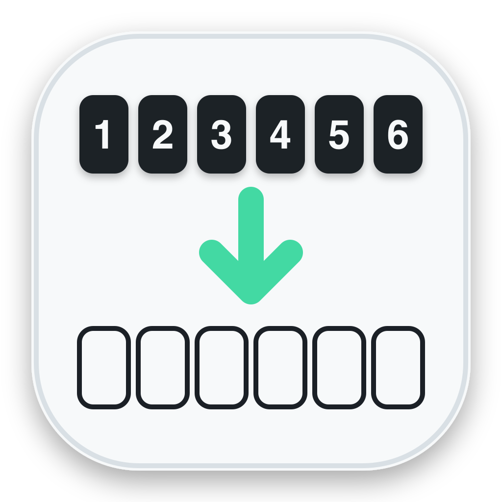
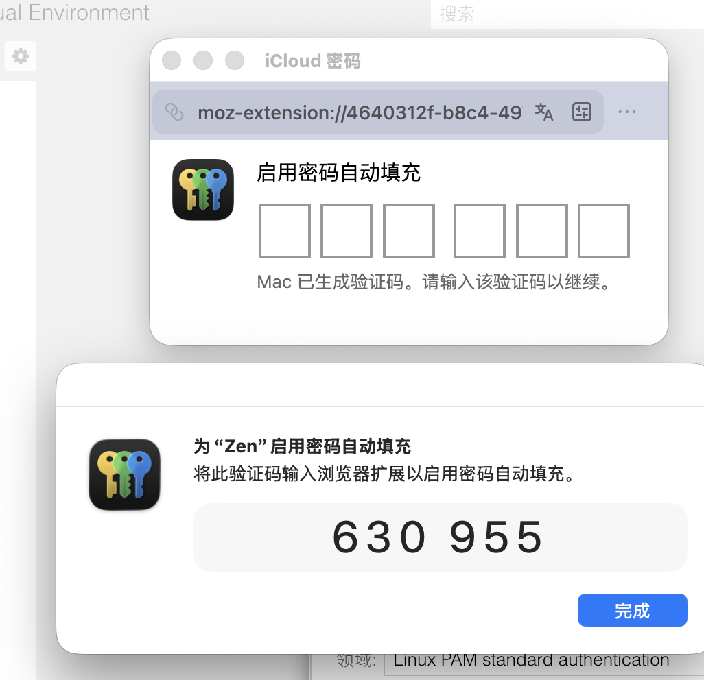

<p align="center">
  
</p>

<h1 align="center">密码桥</h1>

<p align="center">
  自动读取 Apple“密码”生成的浏览器授权验证码，并填回 iCloud 密码扩展。
</p>

<p align="center">
  <a href="https://github.com/Anti2077/ApplePasswordBridge/releases/latest"><strong>下载最新版 DMG</strong></a>
  · <a href="#安装">安装</a>
  · <a href="#首次配置">首次配置</a>
  · <a href="#安全边界">安全边界</a>
</p>

## 它解决什么问题

在 Firefox、Zen 等浏览器中启用 Apple 的 iCloud 密码扩展时，浏览器会弹出六格验证码输入框；与此同时，Apple“密码”会在另一个窗口生成一组六位临时验证码。正常流程需要你：

1. 从浏览器切换到 Apple“密码”。
2. 找到并记住六位验证码。
3. 切回浏览器扩展窗口。
4. 手动把六个数字逐位输入。

<p align="center">
  
</p>

<p align="center"><em>密码桥要省掉的就是截图中“查看验证码，再输入上方六个空格”的步骤。</em></p>

密码桥在后台识别这两个授权窗口，把流程缩短为：

```text
浏览器扩展请求授权 → Apple“密码”生成验证码 → 密码桥读取 → 自动填入浏览器
```

它不会替代 Apple“密码”或 iCloud 密码扩展，也不会读取、保存或同步你的账号密码；它只负责搬运当前授权窗口中的六位临时验证码。

## 主要功能

- 自动监听 Apple“密码”和密码扩展助手的授权窗口。
- 优先通过辅助功能读取验证码，失败时可使用 macOS Vision 本地 OCR。
- 自动找到符合规则的浏览器授权窗口，激活窗口并逐位填入验证码。
- 支持白名单和黑名单，可自行添加 Firefox、Zen 或其他目标应用。
- 提供兼容、稳健、极速三档按键速度，适配不同浏览器响应速度。
- 自动识别失败时可点击“立即填入”，或按 `Control+Option+Command+P`。
- 支持登录后自动启动，全程不使用剪贴板，不发送网络请求。

## 系统要求

- macOS 14 或更高版本。
- Apple 的 iCloud 密码浏览器扩展。
- Firefox 已完成端到端验证；基于 Firefox 或 Chromium 的其他浏览器需自行添加到应用规则并测试。
- 从源码构建需要 Xcode 15.3 或更高版本和 Swift 5.10。

## 安装

1. 从 [GitHub Releases](https://github.com/Anti2077/ApplePasswordBridge/releases/latest) 下载最新版通用 DMG。
2. 打开 DMG，把“Password Bridge”拖入“Applications”。
3. 在 Finder 的“应用程序”中右键“Password Bridge”，选择“打开”。

当前公开版本使用临时签名，未经过 Apple Developer ID 签名和公证。macOS 若仍然拦截，请进入“系统设置 > 隐私与安全性”，点击“仍要打开”。DMG 同时支持 Apple Silicon 和 Intel Mac。

## 首次配置

打开应用后，菜单栏会出现钥匙图标。建议按下面的顺序配置：

| 设置 | 是否必需 | 用途 |
| --- | --- | --- |
| 辅助功能 | 必需 | 观察授权窗口、聚焦输入框，并向目标浏览器输入数字。 |
| 屏幕录制 | 可选 | 辅助功能无法读取验证码时，仅截取 Apple 授权窗口进行本地 OCR。 |
| 应用白名单 | 建议 | 限定密码桥可以扫描和填入的浏览器；首次运行默认包含 Firefox。 |
| 登录后自动启动 | 可选 | 登录 macOS 后自动在菜单栏运行。 |

使用 Zen 或其他浏览器时，点击应用规则旁的 `+`，从“应用程序”文件夹选择对应 App。建议先使用白名单模式，只加入实际需要自动填入的浏览器。

## 日常使用

保持“监听 Apple 密码授权窗口”和“识别后自动填入”开启。当浏览器扩展请求六位验证码时，密码桥会自动：

1. 确认目标浏览器符合应用规则。
2. 确认浏览器窗口同时具有 iCloud 密码标题、扩展 URL 和验证码输入框特征。
3. 从 Apple“密码”或密码扩展助手窗口读取新鲜的六位验证码。
4. 激活目标浏览器，并按所选速度逐位填入。

如果自动填入没有触发，可以打开菜单点击“立即填入”，或按 `Control+Option+Command+P`。输入丢失时可把速度切换为“兼容”；一般情况下建议使用默认的“稳健”。

应用规则提供两种模式：

- **白名单**：仅扫描列表中的应用，范围更小，推荐日常使用。
- **黑名单**：扫描最靠前的普通应用，但跳过列表中的应用以及 Apple 密码相关进程。

## 安全边界

- 验证码来源限定为 Apple“密码”或 Apple 密码扩展助手窗口。
- 来源窗口必须同时出现自动填充授权文案和六位码，避免读取普通短信验证码或网页数字。
- 填入目标必须符合应用规则，并匹配 iCloud 密码标题、`moz-extension://` 或 `chrome-extension://` URL，以及验证码输入框。
- 验证码只在内存中保留 45 秒，不写入日志、磁盘或剪贴板。
- OCR 使用 macOS Vision 在本机完成，不上传截图，不调用网络服务。
- 屏幕录制回退只截取符合尺寸和进程标识的 Apple 授权候选窗口，不扫描整个桌面内容。

## 兼容性

| 浏览器类型 | 状态 |
| --- | --- |
| Firefox | 已完成端到端验证，默认加入白名单。 |
| Zen 等 Firefox 系浏览器 | 授权界面使用 `moz-extension://` 时具备兼容基础，需要手动加入应用规则。 |
| Chromium 系浏览器 | 支持识别 `chrome-extension://` 授权上下文，需要实际扩展界面提供六格输入框。 |
| 其他浏览器 | 尚未验证，取决于 Apple 扩展的窗口标题、URL 和输入框结构。 |

遇到无法识别的浏览器版本时，提交 Issue 时请提供 macOS 版本、浏览器名称与版本、授权窗口截图，以及失败发生在“读取验证码”还是“填入验证码”阶段。请遮盖仍然有效的验证码和其他个人信息。

## 从源码构建

项目使用 Swift Package Manager，没有第三方依赖：

```sh
make test
make app
make dmg
```

构建后的 App 位于 `dist/Password Bridge.app`，通用 DMG 位于 `dist/Password Bridge-<版本>-universal.dmg`。提交和拉取请求会通过 GitHub Actions 自动运行测试。

Developer ID 签名、Apple 公证和 DMG 发布流程见 [发布文档](docs/RELEASING.md)。

## 开源许可

本项目采用 [MIT License](LICENSE) 开源。

“Apple”、“iCloud”和“macOS”是 Apple Inc. 的商标。本项目为独立开源项目，与 Apple Inc. 无隶属、认可或赞助关系。
